# 🏆 SportBoard - Proyecto de Diseño UX/UI e Implementación Web

  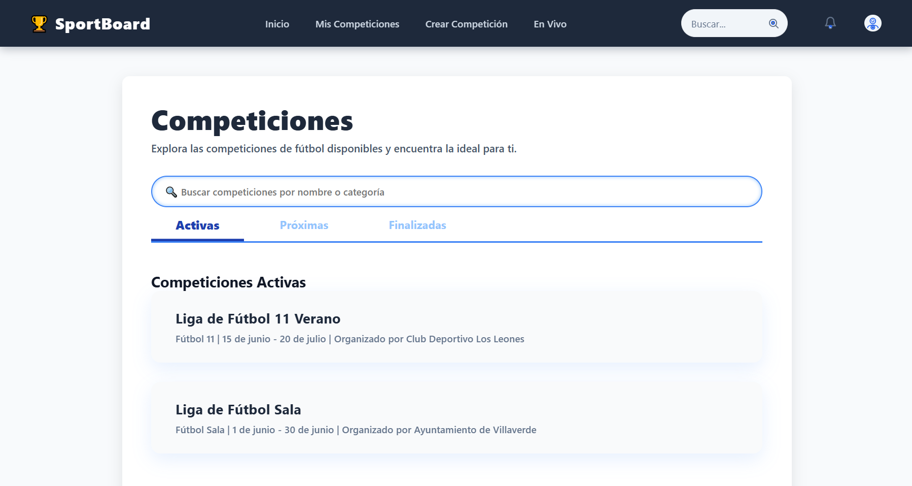 
  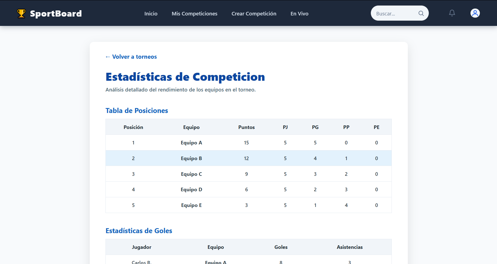 
  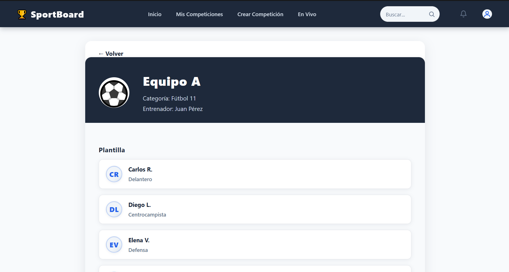 
  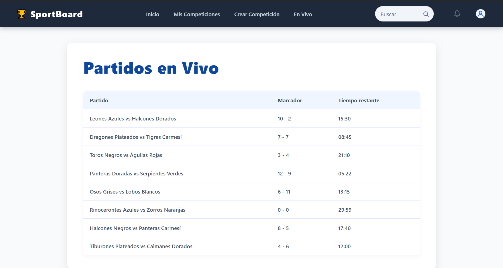 
  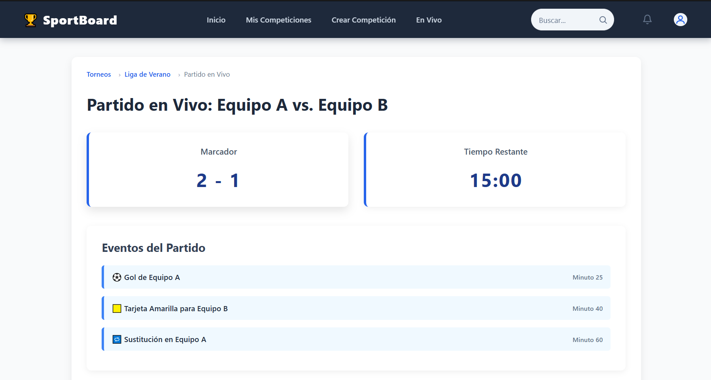 
  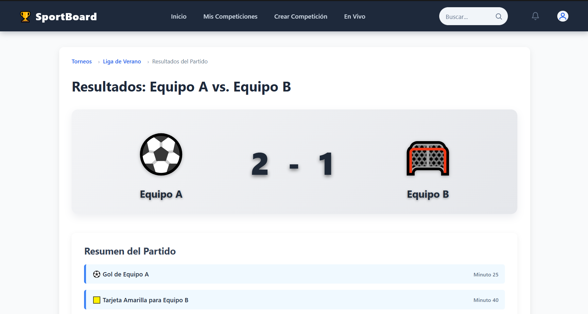 
  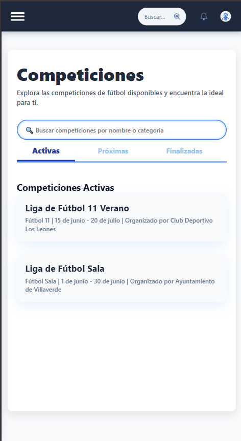 
   
  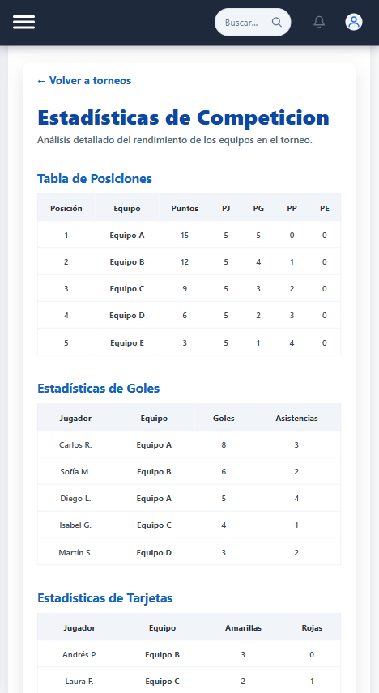 
  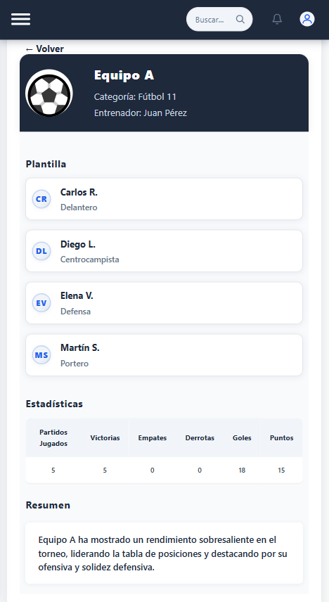 
  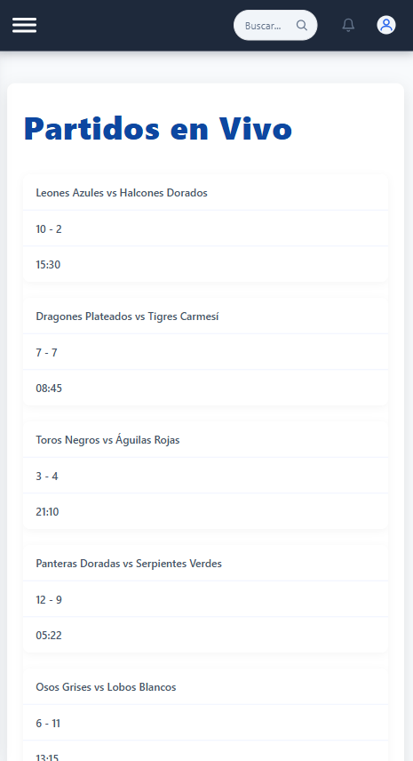 
  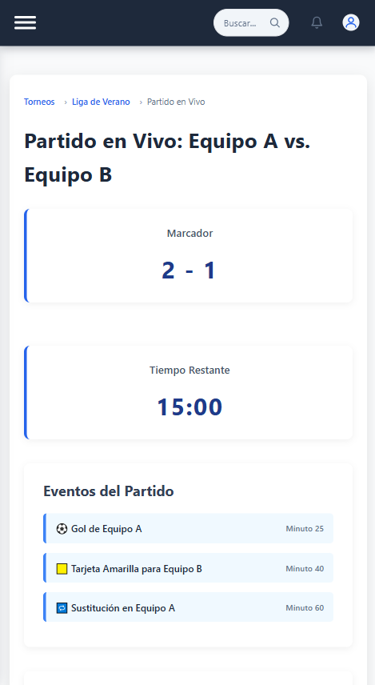 
  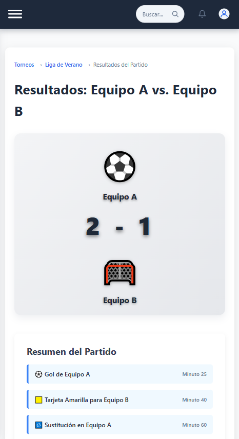

> **Nota:** Las imágenes de la interfaz 7 a la 13 corresponden a vistas diseñadas específicamente para la experiencia en dispositivos móviles.

---

## 📌 Proceso del Proyecto

### 1. 🔍 Investigación de Buenas Prácticas en UX

Se realizó una investigación exhaustiva sobre fundamentos y mejores prácticas en diseño UX utilizando **Google NotebookLM** para recopilar, organizar y sintetizar información clave.

📖 **Principales hallazgos de la investigación:**

- **Diseño centrado en el usuario:** La experiencia debe estar enfocada en satisfacer las necesidades reales de quienes usan el producto.
- **Principios de usabilidad:** Visibilidad del estado del sistema, coincidencia con el mundo real, control del usuario, consistencia, reconocimiento en lugar de recuerdo, y prevención de errores.
- **Accesibilidad:** Interfaces utilizables por todos, incluyendo personas con discapacidad. Se debe garantizar buen contraste, navegación por teclado, textos alternativos, etc.
- **Psicología del usuario:** Aplicar principios como escasez, prueba social, reciprocidad y la paradoja de la elección, de manera ética.
- **Evaluación UX:** Métodos como mapas de calor, pruebas A/B, mapas de empatía, wireframes, pruebas de guerrilla, y heurísticas de Nielsen.
- **Errores comunes:** Como ventanas emergentes invasivas, ignorar estados vacíos/intermedios, o seguir tendencias sin evaluar impacto.

---

### 2. 🎨 Diseño de Interfaces con Google Stitch

Se crearon los prototipos visuales de la aplicación con **Google Stitch**, utilizando el siguiente prompt para guiar el diseño basado en buenas prácticas UX:

## 🧠 Prompt de diseño utilizado

Diseña una aplicación web para gestión de campeonatos deportivos que incluya las siguientes interfaces clave:

- **Página de competiciones:** lista de torneos activos, próximos y finalizados.
- **Estadísticas de competición:** tabla de posiciones, goles, tarjetas, rendimiento general.
- **Estadísticas del equipo:** rendimiento histórico, jugadores destacados, partidos jugados, goles anotados/recibidos.
- **Vista de partido en vivo:** marcador en tiempo real, eventos importantes (goles, tarjetas, sustituciones), resumen de alineaciones de Equipo A vs Equipo B.
- **Listado de partidos en vivo:** accesos rápidos a encuentros que se están jugando.
- **Resultados de partido:** marcador final, eventos del partido, estadísticas, jugadores clave.

### Aplica buenas prácticas de UX en todo el diseño:

- Jerarquía visual clara.
- Estética limpia y minimalista.
- Navegación intuitiva.
- Consistencia en estilos y componentes.
- Lenguaje claro y accesible (nivel de lectura medio).
- Feedback visual inmediato (estado del sistema).
- Prevención de errores (ej. validación en formularios).
- Interfaces accesibles (contraste, texto alternativo, navegación con teclado).
- Diseño adaptable para dispositivos móviles y pantallas grandes.
- Usa colores deportivos modernos (pero evita saturación), íconos claros, y asegúrate de que el diseño esté centrado en las necesidades del usuario final: aficionados, organizadores y jugadores.
- Agrega llamadas a la acción visibles y bien posicionadas.
- No incluyas ventanas emergentes innecesarias.

---

### 3. 💻 Implementación Web con HTML, CSS y JavaScript

A partir de los diseños generados en Stitch, se implementaron las interfaces usando **HTML**, **CSS** y **JavaScript**.

Se utilizó **ChatGPT** para generar el código base siguiendo el diseño y los principios de UX definidos.

🧠 **Prompt utilizado en ChatGPT para la implementación:**

Ayúdame a implementar en código **HTML**, **CSS** y **JavaScript** una aplicación web para gestionar torneos deportivos. Necesito las siguientes páginas:

- **Página de competiciones:** torneos activos, próximos y finalizados.
- **Vista de partido en vivo.**
- **Resultados del partido con estadísticas.**
- **Página de estadísticas generales y de equipo.**
- **Navegación intuitiva** con *header* y *footer* reutilizables.

### Requisitos de implementación:

- Aplica buenas prácticas de **UX** y **diseño responsive**.
- Usa un diseño limpio y moderno.
- Garantiza **accesibilidad**, con jerarquía visual clara.
- Evita sobrecarga visual.
- Si es necesario, incluye algunos scripts para **interacción básica**, como *tabs* o *modales*.

---

### 4. 🚀 Publicación del Proyecto

Una vez finalizada la implementación, se subió el código completo al repositorio de GitHub para su documentación, revisión y despliegue.

🔗 **Repositorio en GitHub:**  
[https://github.com/JhostinJATM/practicaUX_trabajo](https://github.com/JhostinJATM/practicaUX_trabajo)  

---

💡 *“Un buen diseño UX no solo se ve bien, se siente bien y funciona bien para el usuario.”*
